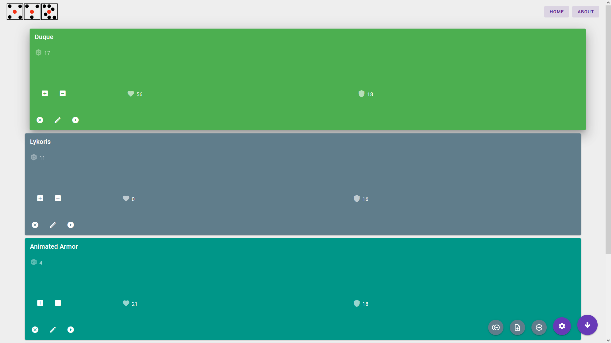

# rollforxyz 1.0
### An initiative tracker for DnD 5e

Roll for XYZ is an online initiative tracker designed for use with DnD 5e.
It aims to provide convienent and customizable features to help Dungeon Masters
focus less on keeping track of who's turn it is or what health an enemy has, and
focus more on having fun!

Made with the Vue.js 3 framework.

## Live @ https://dnd.trevorcorc.com

## Project setup

* `npm install` - Install required modules
* `npm run dev` - Run a development preview of the website
* `npm run build` - Build a production-ready image

## TODO:
At the moment, I consider rollforxyz to be complete, but not finished.
It is reasonably usable and I often make it a part of my DMing sessions.
It's unfortunately not *completely* done, but I do not see the need/have the motivation
finish up the other features you will see below.

In no particular order:
- [x] Scrollable and sorted initiative order
- [x] Ability to add creatures to initiative order
- [x] Removable creatures
- [x] Add Github link
- [x] Add satisfying feedback to button presses (submit, next, etc.)
- [x] Add basic color theme
- [x] Select an arbitrary card as the next in line
- [x] Only begin selecting creatures once the user is done initially adding creatures
- [x] Next button sticks to the bottom of the page
- [x] Page scrolls down when active enemy is off screen
- [x] Add metadata
- [x] Add background and indicator for an empty encounter
- [x] Add notes on creature
- [x] Edit creature
- [x] Health tracker
- [x] Save/load encounters
- [x] Collapsable menu for bottom bar buttons
- [x] Active encounter persists between browsing sessions
- [ ] Add feedback to creature creation
- [ ] Cross out defeated enemy (and scroll past it)
- [ ] Fix add creature dialog to be better on mobile and more sensibly laid out
- [ ] Re-arrange card elements to work on mobile and not look so oddly spaced in general
- [ ] Integrate statblocks (only if legally possible - TBD)
- [ ] Add status checkboxes
- [ ] Roll initiative for you
- [ ] Show actions
- [ ] Icons for creatures
- [ ] Fancy initiative count markers
- [ ] Multiple active encounters
- [ ] Overview of creatures in initiative
- [ ] Nice stylesheet and interface (subjective and a bottomless pit of development time)
- [ ] Encounter templates
- [ ] Mass-add same type of creature (option to roll initiative for you)
- [ ] Real web-app support
- [ ] Portrait-friendly interface option (landscape is default)
- [ ] Color themes

Who knows what else from there! I want the primary function to be *chefs kiss* perfect before moving on to
other, larger features such as:
- [ ] Prepared stat block area
  - Keep stat blocks at the ready during your encounters
- [ ] Custom stat blocks stored by accounts

## Author and License
By Trevor Corcoran

This project is licensed under the GNU GPL 3.0. A copy of this license may be found in the `LICENSE` file.
